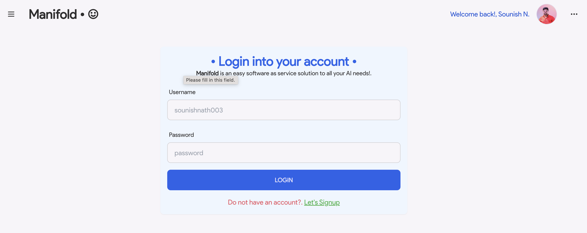
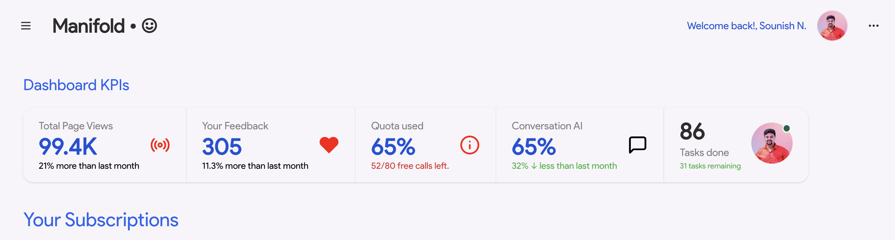

# Manifold

> ** Project is in under development. Feel free to reach out and contribute in the repository.

An open source easy to use one stop solution for all your AI needs. The project has a view of building software as service product, where people can sign in to use the latest and greatest AI and Generative AI powerful models.

## Services

The product has an focused and primary MVP scope of providing the out of the box solution of the following AI services.

- **Conversational AI Service**
- **Image Generation AI Service**
- **Video Generation AI Service**
- **Music Generation AI Service**
- **Speech Generation AI Service**
- **Many more to come...**

## Quotas and Limits

The primary stage of first cut MVP, will have roughly 30 free API calls per account. Going forward, once the free quotas exceeded, user can buy credits as subscription of the service.

## Generative AI Models

We will majorly support all the open sourced Large models across language, images, musics, videos, tables etc.

Proven models of Huggingfaces, Google, OpenAI, LLAMA, Salesforce etc models will have out of the box support.


## Project sneak peaks

### Authentication Screen



### Dashboard Screen


## Contributions

All the intrested developers out there, are very much heartily welcome to contribute and make the project successful ones.

## Project setup
Open your terminal, and execute the following scripts.

> Make sure your have docker installed on your machine to maintain the same project development environment setup.

```bash
git clone https://github.com/sounishnath003/manifold.git
docker-compose up --rebuild
```

## Authors

- [Sounish Nath](flock.sinasini@gmail.com) - software engineer loves to solve and builds projects that helps community to use and learn together. Feel free to connect and discuss - 
  - [LinkedIn](https://www.linkedin.com/in/sounishnath/)
  - [Youtube](https://www.youtube.com/channel/UCX462XzfiVzEiA69XLu2-pw)
  - [Twitter](https://twitter.com/sounish1)

